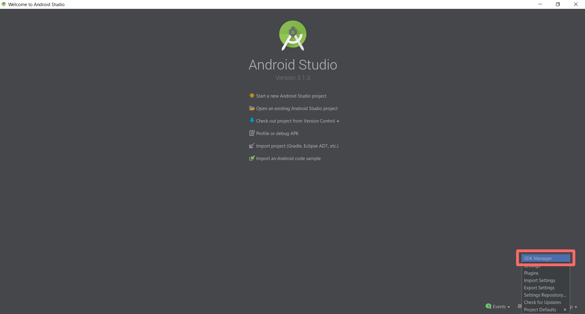
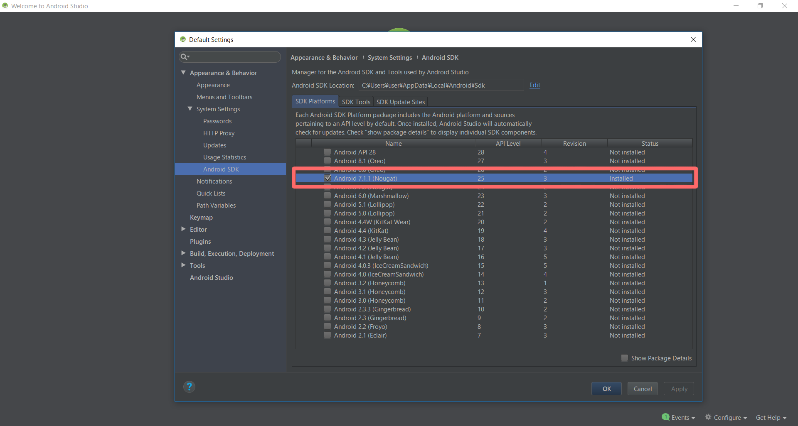
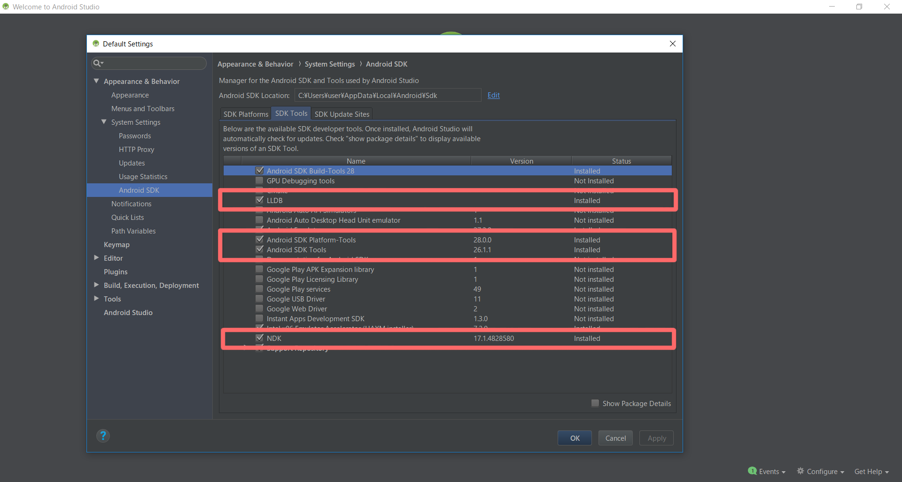

# Unityのセットアップガイド

## はじめに

Oculusアプリから開発者モードを有効にする。Webからの登録作業は私が済ませたので不要なはず。

## インストールするもの

* [Android Studio](https://developer.android.com/studio/?hl=ja#downloads)
  * Windows (64-bit)
* [JDK](http://www.oracle.com/technetwork/java/javase/downloads/jdk8-downloads-2133151.html)
  * Java SE Development Kit 8u172
  * Windows x64
* [Unity Hub](https://unity3d.com/jp/get-unity/download)
* Unity
  * Unity Hub経由でのインストールがおすすめ
  * Unity 2018.1.4f1

## 各種セットアップ

### JDK

インストールするだけ

### Android Studio

* SDKのインストール
  * 右下の歯車アイコンからSDK Managerを選択
    

      
    

  * 以下の画像の通りにSDKを追加(最後にApplyを押してインストールする)
    

      
      
    

### Unity

* プラットフォームをAndroidにする。
  * FileからBuild Settingsを開く
    

      
    

  * Androidを選択
    

      
    

  * Switch Platformをクリック
    

      
    

* Player Settingsの変更
  * Player Settingsをクリック
    

      
      
    

  * Company NameとProduct Nameの変更
    * お好みの名前に変更する
      

        
      

  * Package Nameの変更
    * 設定したCompany NameとProduct Nameをもとにして "com.{Company Name}.{Product Name}" の形にする
      

        
      

  * Minimum API Levelの変更
    * "Android 7.1 'Nougut' (API level 25)" にする
      

        
      

  * XR Settingsの変更
    * XR Settingsを選択する(下のほうにスクロールするとある)
    * Virtual Reality Supportedにチェック
      

        
      

    * Virtual Reality SDKsでOculusを追加(クリック)
      

        
      

* JDKとAndroid SDKのパスを設定する。
  * EditからPreferencesを開く
    

      
    

  * External Toolsからパスを設定する
    

      
    

